# Add-on usage

Flightgear virtual camera. Written in NASAL. Adds features similar to Ezdok
Camera Addon for FSX. User can define it's own view configuration (position
inside/outside the aircraft, look-at and zoom). One can switch between them
using keyboard shortcuts 0-9.

FGCamera covers also dynamic head movement according to defined values and random
movement generator which can simulate any aircraft type (GA, Airliner etc).

# Installation

- extract zip (if downloaded as a zip) to a given location. For example let's
  say we have /myfolder/addons/thisaddon with contents of this addon.
- run flightgear with --addon directive **OR** add it in the Launcher application
  in 'Add-On' section.

# FlightGear configuration

Start FlightGear. Go to menu `View -> FGCamera'. FGCamera default configuration
window will appear.

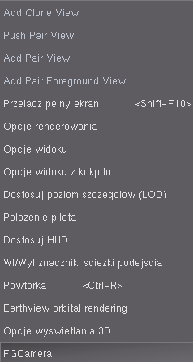

FGCamera configuration can:

* show generic options for FGCamera -> select 'Options' button
* copy selected camera configuration using 'Copy' button. You have to select any
  predefined camera first
* create new camera config using 'Create new camera...' button.

In the next panel, FGCamera lists all camera configurations with it's camera
shortcut and default camera group. In the example we have 'default' view, which
is connected with the '0' key on the keyboard. The default view is in the group
[0]. You can change order of the selected camera view using buttons 'U' and 'D'
(up/down).

In the bottom you have current name of the selected view, current group of the
camera view and options to delete selected camera - button 'Del' and access current
view configuration with button 'CFG'.

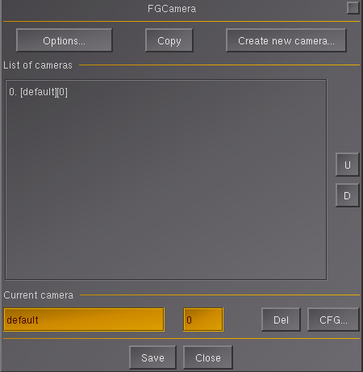

Selecting 'Options' you can define bahaviour of the 'spring loaded mouse' options.

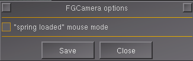

## keyboard shortcuts

* Ctrl+UP/DOWN/RIGHT/LEFT/PGUP/PGDOWN - change current camera view, location and orientation
* 0,1,2...9 - selecting predefined camera view

## creating new camera

Using 'Create new camera...' brings the default dialog for creating it. There
you can define camera name and select camera type.

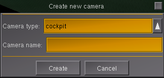

Camera types are as follows:

* cockpit - view from cockpit
* aircraft (look at) - view on aircraft
* aircraft (look from) - view from the aircraft to the outside world
* world (look at) - any perspective
* world (look from) - any perspective

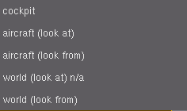

After selecting camera type and its name, the new camera is created. By default
it has view coordination as current user view. Thus you can select view using
CTRL+<controls> keys and next create camera, which would have this view as
predefined.

## camera settings

Camera setting has different options regarding current selected view. Available
options:

* show popupTip - when selecting it, the popup will show it's name
* show 2D panel - display 2D panel with this view (see next paragraph)
* show dialog - display any dialog when this view is selected
* FOV - default field of view (FOV)
* Transition time - time to move from previous view to this one (animated)
* View movement/adjustment - options for selecting/animating transition between
  views
* Mouse look - options for current mouse look (sensitivity etc.)

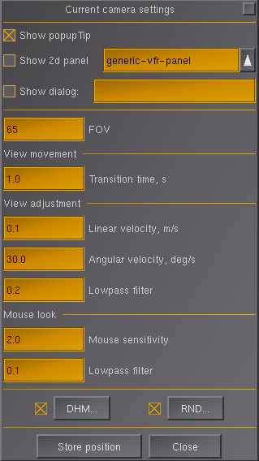

When selecing 2D panel you can choose between two ready-made panels. One with
default controls/gauges for VFR flight control and one with only physical control
display with throttle.

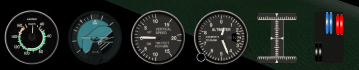

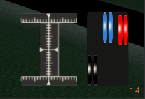

On this options panel, one have two buttons. 'DHM' for options regarding 'Dynamic
Head Movement' and 'RND' for Random movement generator.

## Dynamic Head Movement

When selecting 'DHM' on the view setting dialog, user is moved to the options
regarding dynamic head movement. There you can define various options regarding
this effect. When enabled and configured the view will move according to
defined options the same as normally would move the head of the pilot in the
aircraft.

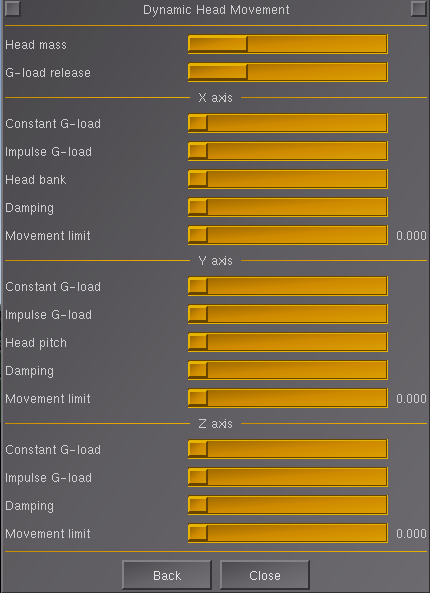

## Random View Generator

When selecting 'RND' on the view settings dialog, one is moved to the Random
View Generator dialog. There you can define predefined random movement. This
option can simulate various aircrafts and situations. When selecting 'Import'
button, you can import predefined Random setting according to plane types e.g.
for General Aircraft (GA) type. Using Ground/Air buttons you can define different
random generator according to the aircraft state (in Air/on the Ground).

When selecting Generator 1...3 you can define additional random signal generators,
that can feed the data to main random generator engine.

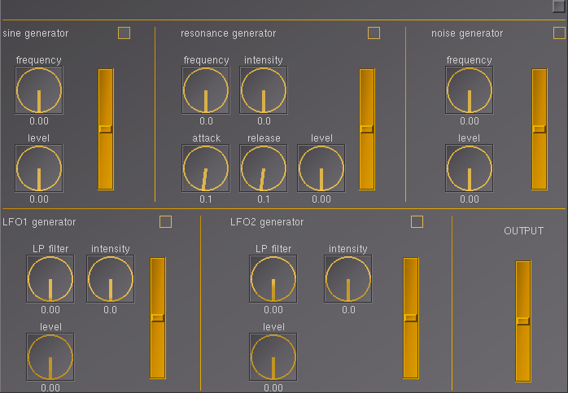

When selecting Curves, you can define additional output gain regarding velocity
in knots.

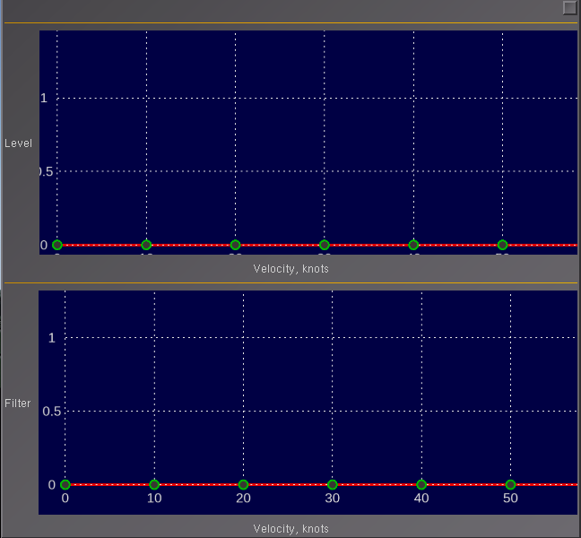

Every configuration is saved with the current aircraft settings.

# Additional resources

* See aircraft-integration.md file for additional API for integration with the
aircraft code in order to get more precise control e.g. walker bypass options
* See headtracker-integration.md file for information how to integrate additional
head-tracker interfaces (beside linuxtrack and irtrack)

Have fun using this addon!

